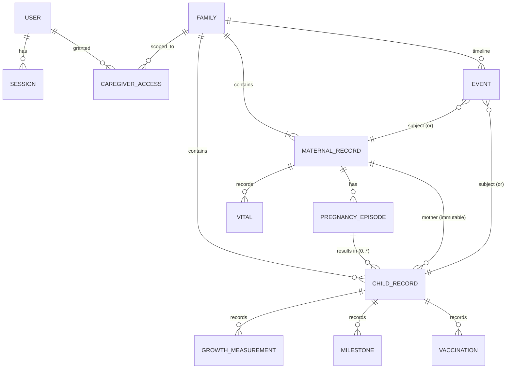

# 71 — Entity Relationship Model

| Field | Value |
|---|---|
| Document | Entity Relationship Model |
| Status | Approved (Draft 1.0) |
| Version | 1.0 |
| Owner | Database Architect |
| Last Updated | 2026-07-22 |
| Related | `70-DATA_DICTIONARY.md`, `docs/04-Architecture/55-DATABASE_MODEL.md`, `docs/08-Timeline/*` |

---

## 1. Purpose

Presents the entity-relationship view of the data model, showing cardinalities and the continuity relationships that make Wise Bloom Care one linked record. It complements the storage-neutral model (`55`) and dictionary (`70`) with an explicit relationship map and the resolution of the multi-pregnancy representation question.

## 2. Scope

Entities, relationships, cardinalities, and continuity constraints. Field detail: `70`, `72`.

## 3. ER Diagram (text)

```
User ──1:*── Session
User ──1:*── CaregiverAccess ──*:1── Family
Family ──1:1..*── MaternalRecord
Family ──1:*── ChildRecord
MaternalRecord ──1:*── PregnancyEpisode        (see §5)
MaternalRecord ──1:*── ChildRecord             (mother link; IMMUTABLE)
PregnancyEpisode ──0:*── ChildRecord           (episode → resulting child(ren))
Family ──1:*── Event   (Event.subject → MaternalRecord | ChildRecord)
MaternalRecord/ChildRecord ──1:*── Vital, Appointment, Medicine, Report, JournalEntry
ChildRecord ──1:*── GrowthMeasurement, Milestone, Vaccination
System ──1:*── AuditRecord
ContentItem, ScheduleEntry : reference data (unscoped)
```

### 3.1 ER Diagram (mermaid)



> `EVENT.subject` is polymorphic (a MaternalRecord or a ChildRecord), unifying the timeline across the journey. `ContentItem` and `ScheduleEntry` are unscoped reference data and are omitted from the diagram.

## 4. Cardinalities & Notes

| Relationship | Cardinality | Notes |
|---|---|---|
| Family–MaternalRecord | 1 : 1..* | usually one; model allows more (future) |
| MaternalRecord–ChildRecord | 1 : 0..* | 0 before delivery / on loss; ≥1 after live birth |
| PregnancyEpisode–ChildRecord | 0..1 episode : 0..* child | multiple births = one episode → many children |
| ChildRecord–mother | * : 1 | **immutable** (Vision BR-V1/BR-V2) |
| Family–Event | 1 : * | continuous timeline |
| ChildRecord–Growth/Milestone/Vaccination | 1 : * | child-scoped |
| Family–CaregiverAccess | 1 : * | multiple caregivers |

## 5. Multi-Pregnancy Representation (resolves `55` OQ-1)

- **Decision:** introduce a **PregnancyEpisode** entity under MaternalRecord. Each pregnancy is an episode with its own LMP/EDD, vitals, appointments, reports, and a delivery outcome. Children link to both the mother (immutable) and the originating episode.
- **Rationale:** supports multiple pregnancies over time, loss episodes (episode ends without a child), and clean association of pregnancy-scoped data to the right pregnancy — without breaking the one-record continuity (the mother and all children/episodes remain one family graph).
- v1 may present a single active episode in the UI while the model supports many (P9, forward-compatible).

## 6. Continuity Constraints

- **CC-1:** A ChildRecord's `mother_id` is set once (by DeliveryService) and never changes.
- **CC-2:** A ChildRecord is created only via a delivery Event on a PregnancyEpisode.
- **CC-3:** The timeline (Events) spans maternal and child subjects as one stream; the delivery Event bridges an episode to its child(ren).
- **CC-4:** No duplicate ChildRecord for one child; multiple births produce distinct children under one episode/delivery Event.
- **CC-5:** A PregnancyEpisode may terminate without a child (loss) — compassionately, no forced child (BR-7).

## 7. Referential Integrity (adapter-enforced)

Since v1 storage (Sheets) lacks constraints, the adapter/services enforce: FK existence on write, immutability of `mother_id`, append-only Events/Audit, uniqueness of PKs, and episode↔child linkage (`docs/04-Architecture/54` §5).

## 8. Business Rules

- BR-1: All relationships and cardinalities above hold in every storage realisation.
- BR-2: PregnancyEpisode is the anchor for pregnancy-scoped data and delivery outcome.
- BR-3: Continuity constraints CC-1…CC-5 are enforced by services.
- BR-4: Reference entities (ContentItem, ScheduleEntry) are unscoped and versioned independently.

## 9. Edge Cases

- Twins/triplets → one episode, one delivery Event, multiple children.
- Consecutive pregnancies → multiple episodes under one mother.
- Loss → terminal episode, no child.
- Caregiver added/removed → CaregiverAccess rows added/revoked; audited.

## 10. Acceptance Criteria

- [x] ER diagram with cardinalities provided.
- [x] Multi-pregnancy resolved via PregnancyEpisode.
- [x] Continuity constraints and adapter-enforced integrity stated.

## 11. Future Expansion

Clinician/device entities; formalise "subject" supertype; offline-sync metadata; additional life-stage entities.

## 12. Dependencies

`70`, `72`, `docs/04-Architecture/54`, `55`, `docs/08-Timeline/111`.

## 13. Open Questions

- OQ-1: v1 UI exposure of multiple episodes (model ready; UX scope TBD).
- OQ-2: "subject" as formal supertype vs. typed reference (`55` OQ-2).

## 14. Risks

- R-1: Pregnancy-scoped data mis-associated across episodes. Mitigation: BR-2 episode anchor.
- R-2: Broken immutability of mother link. Mitigation: CC-1 service enforcement.
