# 111 — Delivery Transition (The Hinge)

| Field | Value |
|---|---|
| Document | Delivery Transition |
| Status | Approved (Draft 1.0) |
| Version | 1.0 |
| Owner | Healthcare Software Architect |
| Last Updated | 2026-07-22 |
| Related | `110-PREGNANCY_TIMELINE.md`, `112-POSTPARTUM.md`, `113-BABY_TIMELINE.md`, `docs/06-Modules/88-DELIVERY_MODULE.md` |

---

## 1. Purpose
Describes the single most important moment in the product: the delivery transition, where the pregnancy timeline and the child timeline meet as **one continuous stream**. The delivery event is the last pregnancy event and the first child event; it automatically creates the linked baby profile. This document defines the timeline mechanics of that hinge (the module behaviour is in `88`).

## 2. Scope
The timeline behaviour across delivery: how the delivery event bridges maternal and child subjects, how continuity is preserved, and how loss is handled. Module logic: `docs/06-Modules/88`.

## 3. The Hinge Model
```
… pregnancy events (subject = mother) …
        │
   ── DELIVERY EVENT ──  (last pregnancy event + first child event)
        │   creates linked child(ren); sets immutable mother link
        ▼
… postpartum events (subject = mother)  ┐
… newborn events (subject = child)       ├─ one continuous timeline, two subjects
```

### 3.1 Sequence: recording a delivery (mermaid)

```mermaid
sequenceDiagram
    actor U as User
    participant API as API (/v1/delivery)
    participant DS as DeliveryService
    participant TL as TimelineService
    participant ST as StorageAdapter
    participant AU as AuditService
    U->>API: POST /v1/delivery (outcome, newborn[s], idempotency-key)
    API->>DS: authorise + validate
    alt live birth
        DS->>ST: create ChildRecord(s) {mother_id immutable, episode_id} (idempotent)
        DS->>TL: append delivery Event (bridges episode ↔ child)
        DS->>AU: audit delivery (integrity event)
        DS-->>API: child(ren) + continued timeline
        API-->>U: baby profile linked; timeline continues
    else loss
        DS->>ST: close PregnancyEpisode (terminal, no child)
        DS->>TL: append compassionate outcome Event
        DS->>AU: audit
        DS-->>API: terminal state (no child)
        API-->>U: compassionate path; no baby prompts
    end
```

### 3.2 Pregnancy episode state machine (mermaid)

```mermaid
stateDiagram-v2
    [*] --> Active: episode created (LMP/EDD)
    Active --> Delivered: delivery event (live birth) --> creates linked child(ren)
    Active --> Loss: loss outcome (no child; compassionate)
    Delivered --> [*]
    Loss --> [*]
    note right of Delivered: mother_id immutable; idempotent; 0 duplicates
    note right of Loss: never forces a child profile (BR-7)
```



- The delivery event belongs to both views: it closes the pregnancy episode and opens the child's life on the **same** timeline.
- No new account, no migration, no duplicate — the child is created once and linked immutably (Vision BR-V2).

## 4. Continuity Mechanics
- The family timeline is a single append-only stream; after delivery it carries both maternal (postpartum) and child (newborn) events, interleaved chronologically.
- The delivery event references the pregnancy episode and the created child(ren), making the bridge explicit and navigable (pregnancy ↔ child).
- Contexts (postpartum + child) activate in parallel (`docs/03-UX/32`), but the underlying record and timeline remain one.

## 5. Loss Handling (compassion)
- If the outcome is loss, the delivery/outcome event closes the episode compassionately **without** creating a child; the timeline continues into maternal recovery + support (`112`), never forcing a baby timeline (BR-7).

## 6. Integrity
- Idempotent creation (no duplicate children on retry); immutable mother link; append-only.
- The transition is audited and monitored (0 duplicate/orphan children — KPI M1, `docs/04-Architecture/64`).
- Rollback runbook exists for the transition (`docs/12-Operations/150`).

## 7. Business Rules
- BR-1 The delivery event is a single event bridging pregnancy and child on one continuous timeline.
- BR-2 It is the sole creator of child records; creation is idempotent; mother link immutable.
- BR-3 The timeline never resets; postpartum + newborn continue the same stream.
- BR-4 Loss closes the episode compassionately without a child.
- BR-5 The transition is audited and integrity-monitored.

## 8. Edge Cases
Multiple births (one event → multiple children on the stream); preterm (GA at birth recorded for corrected-age child timeline); correcting delivery details (versioned; cannot re-point mother link); NICU/irregular early events; retry/timeout (idempotency).

## 9. Acceptance Criteria
- [x] Delivery modelled as the single continuous-timeline hinge (last pregnancy + first child event).
- [x] Automatic, idempotent, linked child creation; no reset/duplicate.
- [x] Compassionate loss handling; audited + monitored.

## 10. Future Expansion
Rich transition summary (guarded AI), clinician birth-record integration, keepsake "birth moment", support-resource surfacing for loss.

## 11. Dependencies
`110`, `112`, `113`, `docs/06-Modules/88`, `89`, `docs/04-Architecture/56`, `64`, `docs/05-Data/71`, `77`, `docs/12-Operations/150`.

## 12. Open Questions
- OQ-1 Exact UX of the transition moment (celebration + calm).
- OQ-2 Loss-path timeline presentation specifics.

## 13. Risks
- R-1 Reset/duplicate breaking continuity. Mitigation: BR-2/BR-3 + monitoring (RSK-2).
- R-2 Emotional harm at loss. Mitigation: BR-4 compassionate design.
