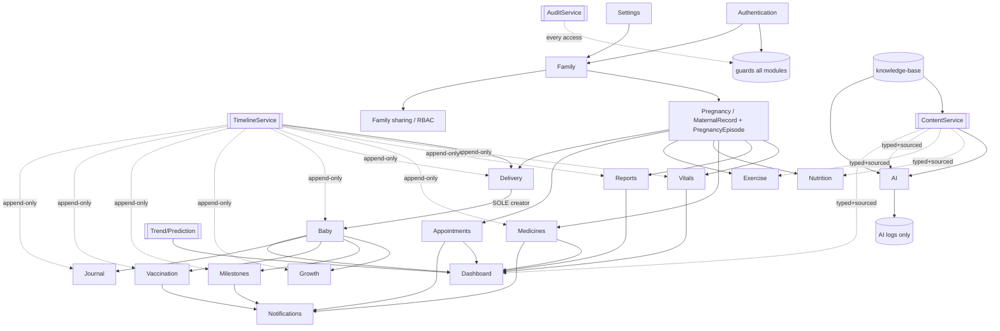

# 203 — Module Dependencies

| Field | Value |
|---|---|
| Document | Module Dependency Graph |
| Status | Approved (Draft 1.0) |
| Version | 1.0 |
| Owner | Staff Engineer |
| Last Updated | 2026-07-22 |
| Architecture Baseline | `v1.0.0-Architecture` (FROZEN) |
| Related | `docs/01-Product/13-MODULE_BREAKDOWN.md`, `docs/06-Modules/*`, `202-BUILD_ORDER.md`, `docs/04-Architecture/52-BACKEND_ARCHITECTURE.md` |

---

## 1. Purpose

Presents the dependency graph between modules and shared services, identifies which modules block others, which are critical, which are independent, and which are safely parallelisable. It refines the dependency overview of `docs/01-Product/13` §4 into an implementation-usable graph. It introduces no new modules (`13` BR-4).

## 2. Modules (frozen set, from `docs/01-Product/13`)

Foundation: **Authentication, Dashboard, Settings, Notifications, Family**. Pregnancy: **Pregnancy, Vitals, Nutrition, Exercise, Medicines, Reports** (Appointments distributed per `13` OQ-1). Transition & child: **Delivery, Baby, Growth, Milestones, Vaccination, Journal**. Intelligence: **AI Assistant**. Shared services (backend, `52` §4): **Timeline, Content, Audit, Trend/Prediction**.

## 3. Dependency Graph

## 4. Shared Services — the spine every module leans on

These are **not** product modules but the cross-cutting services (`52` §4) that most modules depend on. They are built in L2 (Sprint 01) before dependent modules:

| Service | Depended on by | Guarantee |
|---|---|---|
| **AuthService/Session** | every module (guard) | authenticated + authorised access (`57`, `123`) |
| **AuditService** | every health-data operation | who/what/when logged (`75`) |
| **TimelineService** | every history-producing module | append-only, versioned (`77`, `110`) |
| **ContentService** | every module surfacing medical content | `content_type` + `source_ref` (`28`) |
| **Trend/PredictionService** | Vitals, Growth, Dashboard | current/previous/trend; never diagnoses (`52` §6) |

## 5. Blocking Modules (must exist before dependents)

| Module/Service | Blocks | Why |
|---|---|---|
| **Authentication** | all modules | guards every request (`13` §4) |
| **Family** | Maternal, all family-scoped resources | scope/RBAC root (`71` §3) |
| **Pregnancy (MaternalRecord + PregnancyEpisode)** | Vitals, Reports, Medicines, Nutrition, Exercise, Appointments, Delivery | pregnancy-scoped anchor (`71` §5, BR-2) |
| **TimelineService** | every history-producing module | append-only history (`13` BR-3) |
| **Delivery** ★ | Baby, Growth, Milestones, Vaccination, Journal | sole creator of ChildRecord (`13` BR-2, `56` BR-2) |
| **Baby (ChildRecord)** | Growth, Milestones, Vaccination, Journal | child scope parent (`13` §4) |
| **Guardrail layer** | AI Assistant (all AI output) | safety gate (`15` BR-3, `100` BR-1) |

## 6. Critical Modules (product cannot ship v1 without them)

- **Delivery** — the keystone; v1 cannot ship without MS-1.7 (`15` BR-2). Highest architectural risk (`111` R-1).
- **Timeline** — continuity is the product; a broken timeline breaks the thesis.
- **Authentication** — no access, no security baseline.
- **Pregnancy / Vitals / Baby / Growth / Vaccination** — the core continuous-record journey (`14` Phase 1).

## 7. Independent Modules (few hard inbound blockers beyond the spine)

- **Settings** (`97`) — depends only on Auth/Family; buildable early or late.
- **Journal** (`93`) — depends on subject (maternal or child) + Timeline; otherwise self-contained.
- **Nutrition / Exercise** (`86`, `87`) — depend on Pregnancy context + Content; otherwise independent guidance/logging.
- **Knowledge-base content authoring** — code-independent (`59` BR-3); can proceed on its own track any time.

## 8. Parallelisable Modules

Given the spine (Auth, Timeline, Content, Audit) and the contract, these sets are safe to build concurrently (see `202` §6 for the concurrency rule):

- **Set P1 (post-Pregnancy-core):** Vitals ‖ Reports ‖ Dashboard read-model.
- **Set P2 (pregnancy management):** Appointments ‖ Medicines ‖ Nutrition ‖ Exercise.
- **Set P3 (post-Delivery):** Growth ‖ Milestones ‖ Vaccination ‖ Journal.
- **Set P4 (intelligence, post-guardrails):** RAG retriever ‖ Prompt library ‖ Prediction engine.
- **Always parallel:** Frontend features against the contract ‖ backend implementation ‖ knowledge-base authoring.

## 9. Dependency Rules (enforced)

- BR-1: A module never writes to another module's owned data directly; cross-module reads go through the service/API layer (`13` BR-1).
- BR-2: Delivery is the only creator of Child records (`13` BR-2, `88`).
- BR-3: Every history-producing module uses the shared TimelineService (`13` BR-3).
- BR-4: Any module surfacing medical content goes through ContentService (typed + sourced) (`52` BR-5).
- BR-5: Notifications are triggered by Medicines, Appointments, Vaccination, Milestones — Notifications does not own that domain data, only the queue/log (`13` §4, `95`).

## 10. Acceptance Criteria

- [x] Full dependency graph for the frozen module set, with the shared-service spine explicit.
- [x] Blocking, critical, independent, and parallelisable modules identified.
- [x] Delivery-as-sole-child-creator hinge shown as the transition dependency.
- [x] Dependency rules restated from `13`/`52` without adding modules.

## 11. Dependencies

`docs/01-Product/13`, `docs/06-Modules/*`, `docs/04-Architecture/52`, `202-BUILD_ORDER.md`, `docs/08-Timeline/111`.

## 12. Risks

- R-1: Module boundary erosion (cross-writes). Mitigation: BR-1 + conformance review (`13` R-1).
- R-2: A child-scoped module wired before Delivery exists. Mitigation: §5 blocking table + build gate G-4 (`202` §7).
